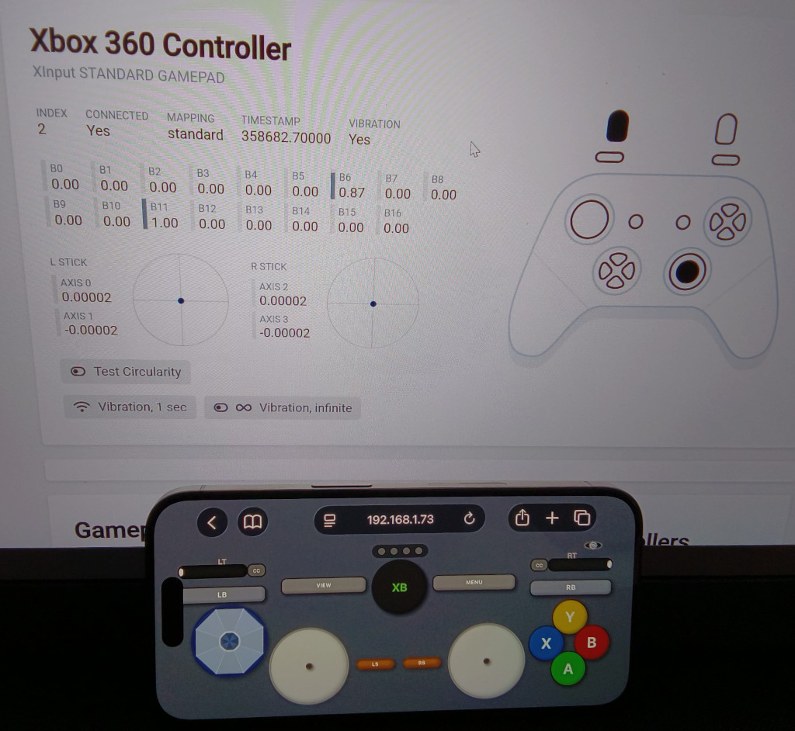
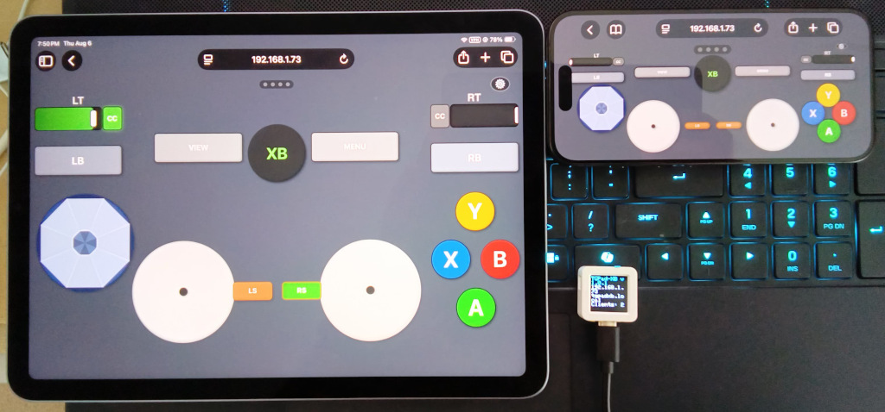

# TGPad-XB — WiFi Touch Gamepad for Xbox/PC

WiFi gamepad running on an ESP32-S3 that appears as an **Xbox-compatible XInput controller** over USB.
Control it from any browser — no software installation needed on the host PC or console.

Built on the [ESP32XInput](https://github.com/controllercustom/ESP32XInput) library.


*Phone running TGPad-XB web UI with Win11 browser open to https://hardwaretester.com/gamepad.*


*Tablet, phone, and AtomS3 running tgpadxb.*

## Features
- **USB HID**: 16-button XInput gamepad with dual analog sticks, triggers (LT/RT), D-pad, and face buttons (A/B/X/Y)
- **Analog triggers**: Full-range LT/RT support. The CC (Cruise Control) buttons beside each trigger toggle a hold mode — when enabled, the slider locks at its current position until moved again or CC is turned off.
- **Web UI**: Xbox-layout gamepad with shoulder bumpers/back/start, LED indicator panel, center console button, and trigger sliders
- **WiFi**: Auto-config via WiFiManager captive portal (`TGPad-XB-Config` AP)
- **Multi-client**: Up to 5 simultaneous WebSocket clients (OR-combined buttons, last-writer-wins for axes/triggers)
- **OTA**: ArduinoOTA + web-based firmware update (optional password auth via `#define OTA_PASS`)

## Supported Boards
| Board | FQBN | Notes |
|-------|------|-------|
| Generic ESP32-S3 dev module | `esp32:esp32:esp32s3:USBMode=default,CDCOnBoot=default` | Default target, verified ✅ |
| M5Stack AtomS3 (8MB) | `esp32:esp32:m5stack_atoms3:PartitionScheme=default_8MB,USBMode=default,CDCOnBoot=default` | Verified ✅ |

## Console Compatibility

TGPad-XB running on an **AtomS3** works with an Xbox One console via a [Mayflash Magic-X](https://www.mayflash.com/products/magic-x) converter. The Magic-X also supports Xbox Series X|S consoles.

## Web Flasher
Flash the firmware directly from your browser at https://controllercustom.github.io/tgpadxb/

Put your AtomS3 board in download mode (hold BOOT while pressing EN/RST), then click **Flash Firmware** on the page and select the serial device when prompted. No tools or drivers needed — works in Chrome, Edge, or any Web Serial–capable browser.

## Getting Source Code
The project uses git submodules for libraries (`lib/ESP32XInput`, `lib/WiFiManager`, `lib/WebSockets`, `lib/M5GFX`). Clone recursively to fetch them:

```bash
git clone --recursive https://github.com/controllercustom/tgpadxb.git
cd tgpadxb
```

If you already cloned without `--recursive`:

```bash
cd tgpadxb && git submodule update --init --recursive
```

## Build & Upload

Build profiles are defined in `sketch.yaml` — no manual FQBN or library flags needed. The default profile is **atoms3**. Use Arduino CLI 1.5+ for profile support.

```bash
# Compile (default: M5Stack AtomS3)
arduino-cli compile .

# Generic ESP32-S3
arduino-cli compile --profile esp32s3 .

# Serial upload AtomS3 -- Press side button on AtomS3 until the LED inside turns green
arduino-cli upload -p /dev/ttyACM0 --profile atoms3 .    # AtomS3
# Serial upload esp32s3 -- Uses the UART port so can be done without button pressing
arduino-cli upload -p /dev/ttyUSB0 --profile esp32s3 .   # Generic ESP32-S3

# OTA upload — board must have WiFi connected
arduino-cli compile --output-dir /tmp/tgap_ota_build . && \
  arduino-cli upload -p tgpadxb.local --upload-field password="" \
     --protocol network --profile atoms3 --input-dir /tmp/tgap_ota_build .

# Fallback OTA (espota.py) — check exit code, not progress output:
ESPOTA=~/.arduino15/packages/esp32/hardware/esp32/3.3.10/tools/espota.py
python3 "$ESPOTA" -r -i <IP> -p 3232 --auth="" \
  -f /tmp/tgap_ota_build/tgpadxb.ino.bin; echo "EXIT=$?"

# Fallback OTA (web update, HTTP port 80):
curl -F "firmware=@/tmp/tgap_ota_build/tgpadxb.ino.bin" http://<IP>/update; echo "EXIT=$?"
```

## Testing
```bash
pip3 install -r test/requirements.txt

# Offline unit tests (no hardware needed)
python3 -m pytest test/ -v --ignore=test/e2e

# Hardware e2e tests — requires root for evdev, set host IP via env var
sudo TGPADXB_HOST=192.168.1.x python3 -m pytest test/e2e -v

# Full e2e with multi-client tests enabled (requires generic ESP32-S3)
sudo TGPADXB_HOST=192.168.1.x TGPADXB_MULTICLIENT=1 python3 -m pytest test/e2e -v
```

- Multi-client e2e tests are **skipped by default**. Enable with `TGPADXB_MULTICLIENT=1` (requires a generic ESP32-S3 dev module; AtomS3 reports slot 0 for every client so OR-combine cannot be verified there). See `test/conftest.py`.
- e2e tests connect to the board over WebSocket port **81** and read USB HID events via python-evdev.

## Verified Status
- **Offline tests**: 39/39 passing (button mapping, stick scaling, trigger range, d-pad tokens, multi-client state, watchdog)
- **Hardware e2e + multiclient** (generic ESP32-S3): 14/14 passed — all basic tests plus two-client independent, same-button no-stuck, L3 disconnect, four-step L3+R3

## Related Project

- [TGPad-NS — WiFi Touch Gamepad for Nintendo Switch](https://github.com/controllercustom/tgpadns)
- [One Finger Touch Screen WASD Keyboard](https://github.com/controllercustom/touchwasd)
- [Touch Screen QWERTY Assistive Keyboard](https://github.com/controllercustom/ikeys)

## License
MIT
